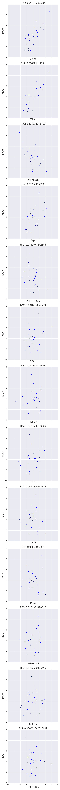

# Feature-Selection-Visualization
Plot residuals during forward stepwise feature selection

## Caution

"We do not recommend the use of any of the automatic model-building procedures for three reasons"

Judd, Charles M., Gary H. McClelland, and Carey S. Ryan. Data analysis: A model comparison approach. Routledge, 2011.

## Overview and Rationale

I'm often asking the following two questions: 1) Which variable is most predictive?  2) After I've regressed on the most predictive variable, which variable is most predictive? (And you can keep iterating).

This program visualizes each iteration of stepwise forward feature selection.  At each iteration, it plots the predictor variables against residuals of the previous model, so you can visualize how predictive each variable on top of your previous model.  It then automatically adds the best variable to the model and continues iteration.

## Example

The code for this example can be found in `example.py`. Unfortunately, this example uses a lot of basketball jargon.

Here, we are trying to predict a team's average margin of victory given various advanced statistics (True Shooting %, Turnover %, etc).  First, the program plots each predictor variable against the margin of victory for each team.

It looks like eFG% (effective field goal %) was the most predictive variable.  Now the program regresses on eFG% and plots each predictor variable against the residuals of the current model.  

The program iterates until it reaches a user specified depth.
